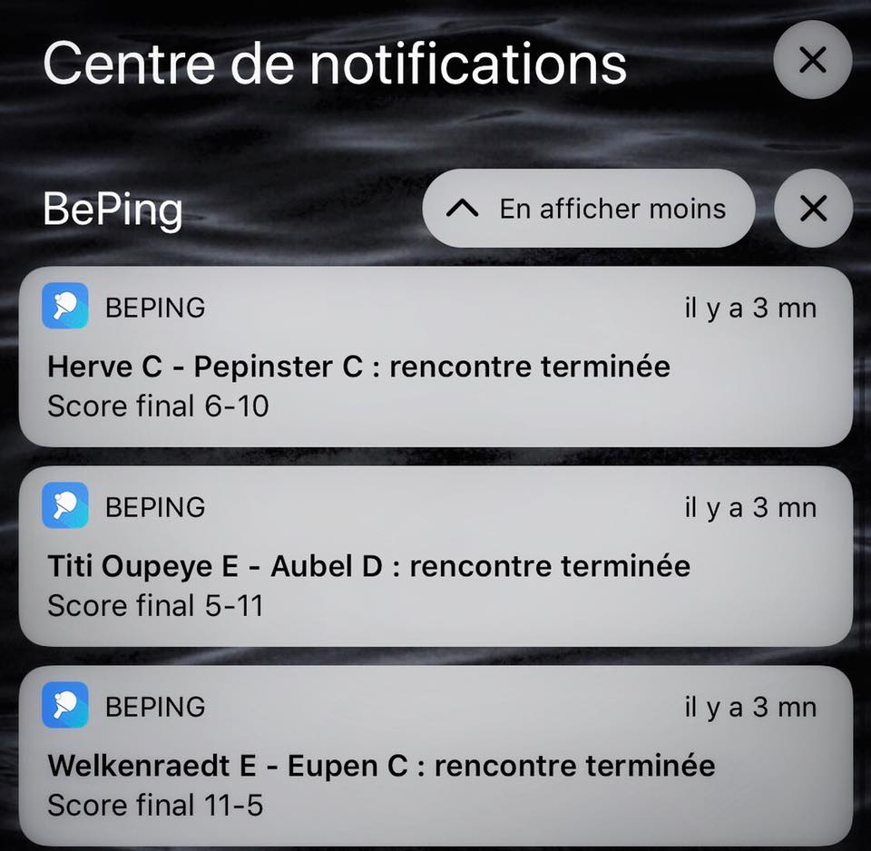

# BePing Hook
Match results notifications producer for BePing ([App Store](https://apps.apple.com/be/app/beping/id1358319169?l=fr), [Play Store](https://play.google.com/store/apps/details?id=be.floca.beping&hl=fr)).

This project is based on the node-decomposing demonstration from [errogien](https://github.com/errogien)

## How does it work?
In Beping, users can subscribe to results notifications for specific clubs/teams/divisions. The list of subscriptions is persisted in Firebase.
At midnight the master process will check all the subscriptions requested by users and will dispatch work load to workers. If a user add a new subscription during the day, the master process will react and will dispatch one event to the worker.

Each worker is responsible of monitoring some divisions/clubs/teams using [TabT-Api](https://github.com/gfrenoy/TabT-API). The master process will dispatch work in a distributable way, all workers has the same workload.
Workers check results of one of their tasks on a defined time interval in a round robbin manner. Once results are available from the API, the worker send a notification to the right topic on Firebase.
